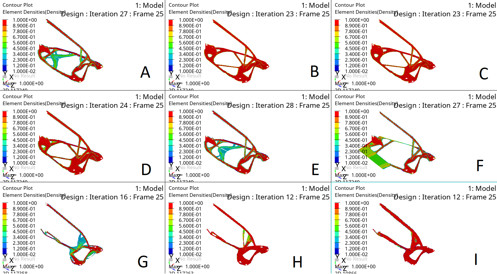

# Increasing the Structural Rigidity of the Manipulator

*A comprehensive study on topology optimization using the SIMP algorithm for robotic manipulator design*

**Author:** Nikita Arkhipov, Engineer  
**Keywords:** manipulator, topology optimization, finite element model, SIMP algorithm, structural analysis

---

## Abstract

This article presents a complex of design and engineering works to ensure manipulator deflection of no more than 0.3 mm. The object of research is a robotic manipulator. The purpose of the R&D is to optimize the design of the following manipulator components:

- Aluminum bracket
- Steel U-shaped bracket
- Steel "Fin" bracket

**Results of the work performed:**

A refined electronic model of the manipulator was developed based on the results of bracket optimization, and the manipulator was calculated for static strength under maximum overload from motors. A list of proposals for design modifications was formed. An electronic model of the optimized design was developed, including verification calculations of the structure.

The required stiffness results could not be fully achieved. However, the structural stiffness was significantly increased:

- Displacement from vertical load decreased by 57%
- Displacement from horizontal load along the x-axis decreased by 65%
- Displacement from horizontal load along the z-axis decreased by 66%
- Displacement from moment about the x-axis decreased by 66%
- Displacement from moment about the y-axis decreased by 76%
- Displacement from moment about the z-axis decreased by 67%

---

## Abbreviations and Designations

| Abbreviation | Definition |
|:-------------|:-----------|
| TOR | Technical Requirements |
| EM | Electronic Model |
| FE | Finite Element |
| FEM | Finite Element Model |
| SSS | Stress-Strain State |
| CG | Center of Gravity |
| CS | Coordinate System |

---

## Introduction

As initial data for the analysis of the manipulator design, the Customer provided a contour made in surfaces, as well as an EM of the manipulator in folded form. Within the scope of work, an analysis of the manipulator was conducted and the stiffness properties of the structure were increased, capable of withstanding the static loads and overloads from motors acting on it, while having the minimum possible mass.

As initial data for optimizing the manipulator design, the Customer provided an EM of the manipulator. Within the scope of work, the design was refined and calculated for static strength under overload conditions, and recommendations for refinement were developed.

---

## 1. Development of the Manipulator Design

### 1.1 Formation of the Manipulator Concept

Within the scope of work, it was required to optimize the manipulator design. According to the technical requirements, the main requirements for the manipulator design are as follows:

- The structure must withstand a static load from a weight of 1.1 kg
- The deflection of the manipulator tip should not exceed 0.3 mm
- Allowable mass increase: no more than 15%
- It is necessary to maintain the current bending angles equal to 270° per joint
- Do not increase the number of unique (custom-manufactured) parts

### 1.2 Description of the Main Elements of the Manipulator

The stiffness requirement is expected to be met by changing the shape of the brackets in the main part of the manipulator.


*Figure 1 – Manipulator – general view*

As can be seen from Figure 1, the manipulator design consists of a stand (Figure 2), 4 U-shaped steel brackets (Figure 3), 4 aluminum brackets (Figure 4), 1 steel "fin" bracket (Figure 5) and 10 servo drives.


*Figure 2 – Stand general view*

 

*Figure 3 – Steel U-shaped bracket*

 

*Figure 4 – Aluminum bracket*


*Figure 5 – Steel "fin" bracket*

**Material distribution map in the model:**


*Figure 6 – Model elements made of steel*


*Figure 7 – Model elements made of aluminum*

---

## 1.3 Building the FEM Model

To create the FEM, it is necessary to simplify the model for faster operation. It was decided to consider the stand as absolutely rigid and replace the attachment of manipulator nodes to the stand with boundary conditions (by fixing the attachment points of the manipulator to the stand). It was also decided to replace the modeling of the last link of the manipulator (gripper assembly) with an absolutely rigid link.


*Figure 8 – FEM model general view*


*Figure 9 – Element types used in the model*

The U-shaped bracket and "fin" bracket were decided to be modeled with flat QUAD4 type elements since one of the part dimensions (thickness) << than the other 2 part dimensions. QUAD4 is a flat 4-node element with 6 degrees of freedom per node.


*Figure 10 – FEM of steel U-shaped bracket*


*Figure 11 – FEM of steel "fin" bracket*

The aluminum bracket and bearing were decided to be modeled with HEX8 type solid elements since they are more accurate than tetra4. HEX8 is a solid 8-node element with 3 degrees of freedom per node.


*Figure 12 – FEM of aluminum bracket*


*Figure 13 – FEM of bearing*

### Modeling Force Transmission and Bolt Connections

To model the force transmission from motors to the bracket and bearing, it was decided to model it with an RBE2 type element. It was also decided to replace the bolts connecting elements with RBE2. RBE2 is an absolutely rigid finite element (the displacement of the master node equals the displacement of the slave nodes). Servo motor modeling is replaced by 1 RBE2 element where the slave nodes are the motor mounting nodes and the master node is the RBE2 element for the bearing with the steel bracket.

There are 4 ways to model bolts:

1. **First way:** Model bolts using a beam two-node finite element with 6 degrees of freedom at each node and tie its nodes to the surface using RBE2 or RBE3 elements.
2. **Second way:** Boundary conditions in the bolt attachment zone.
3. **Third way:** Model bolts using an RBE2 element.
4. **Fourth way:** Model the bolt using a solid eight-node finite element in the form of a hexahedron with 3 degrees of freedom at each node. For this method, it is necessary to specify contacts between the bolt and the part. This allows more accurate modeling of bolt connection behavior but complicates the FEM.

We will use the third modeling method to speed up calculation and optimization.


*Figure 14 – FEM of servo motor modeling*


*Figure 15 – RBE2 elements replacing bolts*

### Contact Interaction Setup

Between the bearing and aluminum bracket, it was decided to create a Slide type contact interaction. For this, it is necessary to create contact surfaces and specify the surfaces that will be in contact. After that, CONTACT must be configured: Select the master surface (MASTER) and slave surface (SLAVE). They differ in that during contact, OPTISTRUCT checks whether the slave surface intersects the plane of the master surface with points; if so, OPTISTRUCT will calculate the contact area based on these intersected points.

The master surface should be selected as the surface with the larger element size. It is also important to specify SRCHDIST and CLEARANCE (gap). The first parameter indicates at what distance to consider surfaces in contact, while the second parameter shows the gap.

In these analyses, SLIDE type contact is a contact type where there is no friction between surfaces. There is an additional contact setting N2S or S2S. The first contact type is the fastest in terms of computational power but less accurately provides the contact pressure picture. The second is accurate but significantly slows down the calculation.


*Figure 16 – Contact interaction of bearings and bracket*

---

## 1.4 Formation of Load Cases

To calculate the manipulator for static strength, it is necessary to determine the loading modes.

Let's define the safety factor K as 1.5.

**Vertical force** is calculated as the load mass m times the acceleration due to gravity g times the safety factor K:

```
Fy = m·g·K = 16.18 N
```

**Horizontal force** is calculated as the angular acceleration of rotation from motors times the distance from the rotation axis to the load application point R times the load mass m and times the safety factor K:

```
Fx = ε·R·m·K = 6.73 N
```

**Longitudinal force** is calculated as the angular velocity squared ω² times the distance from the rotation axis to the load application point R times the load mass m and times the safety factor K:

```
Fz = ω²·R·m·K = 72.49 N
```

**Moment about the x-axis** is calculated as the moment of inertia about the center of gravity Jx_cg plus the mass m times the distance from the center of gravity to the rotation axis squared d1 times the safety factor K and angular acceleration about the rotation axis plus the vertical force Fy times the distance from the force application point to the rotation axis l1:

```
Mx = (Jx_cg + m·d1²)·K·ε + Fy·l1 = 651 N·mm
```

**Moment about the y-axis** is calculated as the moment of inertia about the center of gravity Jy_cg plus the mass m times the distance from the center of gravity to the rotation axis squared d2 times the safety factor K and angular acceleration about the rotation axis plus the horizontal force Fx times the distance from the force application point to the rotation axis l2:

```
My = (Jy_cg + m·d2²)·K·ε + Fx·l2 = 635 N·mm
```

**Moment about the z-axis** is calculated as the moment of inertia about the center of gravity Jz_cg plus the mass m times the distance from the center of gravity to the rotation axis squared d3 times the safety factor K and angular acceleration about the rotation axis:

```
Mz = (Jz_cg + m·d3²)·K·ε = 133 N·mm
```

### Symbol Reference Table

| Symbol | Description | Unit of Measurement |
|:-------|:------------|:--------------------|
| Fy | Vertical force (Weight) | N |
| Fx | Horizontal force (Tangential inertia force) | N |
| Fz | Longitudinal force (Centrifugal force) | N |
| Mx | Total moment about X-axis | N·mm |
| My | Total moment about Y-axis | N·mm |
| Mz | Torsional moment about Z-axis | N·mm |
| m | Load mass | t |
| g | Acceleration due to gravity | mm/s² |
| K | Safety factor | Dimensionless |
| ε | Angular acceleration | rad/s² |
| ω | Angular velocity | rad/s |
| R | Distance from rotation axis to load CG | mm |
| J_cg | Moment of inertia of load about its CG (with index x, y, z) | t·mm² |
| d | Distance from load CG to rotation axis (with index 1, 2, 3) | mm |
| l | Distance from force application point to rotation axis (with index 1, 2) | mm |

---

## 1.5 Analysis of Results

The analysis results were as follows:

| Load Case | Fx | Fy | Fz | Mx | My | Mz |
|:---------:|:--:|:--:|:--:|:--:|:--:|:--:|
| Maximum displacement (mm) | 1.03 | 1.05 | 0.62 | 0.12 | 0.17 | 0.03 |
| Maximum stress (MPa) | 93 | 92 | 65 | 10 | 14 | 4 |


*Figure 17 – Location of the most loaded areas, load case and stresses occurring in these areas*

Maximum stresses occur at bolt attachment nodes to parts. The fin is subjected to the highest stress.

---

## 1.6 Fundamentals of the Topology Optimization Method (using the SIMP algorithm)

Optimization methods are divided into two categories – conceptual design and refinements.

**Optimization at the conceptual level** means performing optimization (either topology or topography optimization) at the initial stage of the design process to create the best shape from which to proceed further.

The optimization program essentially automates the design – analysis – model feedback – redesign process. This allows changes to be made to the structure according to design criteria without changing the overall topology. Design optimization can be based on optimization of specific dimensions, shape, or arbitrarily selected shape.

**Topology optimization** is related to material distribution and how elements are connected within the structure. It considers the "equivalent density" or pseudo-density of each element as a design variable.

### The SIMP Method

The topology optimization method allows determining the optimal distribution of material in a given design area, corresponding to given boundary conditions, loading modes, as well as fulfilling imposed additional constraints. The idea of the method is to determine the optimal distribution of material in each part of the design area. For this, the design area is divided into N elements. Each element is either filled with material or empty. Accordingly, the number of different combinations will be 2^N where N is the number of elements.

To solve the optimization problem using the SIMP method, the material density of each element continuously varies in the range from 0 to 1 or from ρ_min – minimum pseudo-density to 1:

```
0 ≤ ρ_min ≤ ρ ≤ 1
```

Taking this condition into account, when finding the minimum of the objective function, the material density is varied. To solve the problem, it is preferable to use the "penalty method" using a power representation of elastic properties of the material, which can be expressed as:

```
E(ρe) = ρe^p · E
```

where E is the elastic modulus and p is the "penalty coefficient" which is always greater than 1, or for the element stiffness matrix as:

```
K(ρe) = ρe^p · K
```

where K is the element stiffness matrix and p is the "penalty coefficient" which is always greater than 1.

### Compliance and Stiffness

The overall stiffness of the structure can also be used as an objective function. This can also be considered as minimizing compliance at a given mass reduction. Compliance is a measure of the overall mobility or "softness" of the structure – it is the inverse of stiffness. Total compliance equals the sum of strain energies or elastic energy in the elements. Minimizing total compliance is equivalent to maximizing total stiffness.

The optimization algorithm through an iterative process seeks to determine element densities that minimize the overall compliance of the structure:

```
C(ρ) = Σ(i=1 to N) ρi^p · ui^T · ki · ui
```

where u is the displacement vector of the i-th element, k is the stiffness matrix of the i-th element, ρ is the pseudo-density of the corresponding element. The equation has the form:

```
K·U = F
```

where K is the stiffness matrix, U is the displacement matrix, F is the force vector.

### Manufacturability Considerations

A structure whose shape is determined based on three-dimensional optimization, in many cases cannot be manufactured using standard technologies. Therefore, in such cases, an assessment of the manufacturability of the geometry of optimized structures is necessary. Also, to solve this problem, certain constraints can be set during optimization, contributing to obtaining geometry ready for manufacturing by various traditional production technologies.

Therefore, for optimization from the above algorithm, for each optimized part it is necessary to create a **Des space** – an extended geometry in which the search for the optimal design will be performed.


*Figure 18 – Des space of steel U-shaped bracket*


*Figure 19 – Des space of aluminum bracket*


*Figure 20 – Des space of steel "fin" bracket*

### Optimization Parameters and Constraints

To perform optimization, it is necessary to create variables or parameters (responses) of the model by which the part will be optimized. We create 2 system responses or parameters:

**First parameter - wcompliance (weighted compliance).** The ratio has the form:


**Second parameter - mass in the given design space.** This parameter gives us the mass of the design area. It can be defined for the entire structure, as well as for individual properties (components) and materials or for groups of properties (components) and materials.

In addition to the objective function (namely, reducing compliance), it is necessary to specify constraints. **dconstrain** is a constraint that the solver should not violate. In calculations, the mass should not differ from the mass of the previous part by more than 15%. This means that the mass constraint for each design zone will be different. In this program, you can also specify a constraint on volume or relative volume or relative mass. The difference between relative mass and relative volume is that relative mass includes the mass of the entire model in the calculation, while volume fraction only considers the design area.

To find the most optimal shape, it is necessary to create an objective function. This function is the extremum we must find. Various system responses are specified here (displacement, twist angle, stresses, etc.). In this case, we specify wcompliance as the function whose minimum the program will search for.

Then we set additional optimization constraints. Additional constraints besides mass will also be the **maximum allowable stress of 150 MPa**. This parameter should be below the yield strength of the material because when the yield strength is reached, the part will plastically deform, which can lead to very serious consequences. It should be understood that the stress constraint value will be compared with the stress in the element according to von Mises theory.

### Manufacturing Constraints in OptiStruct

The problem with topology optimization is that the developed design concepts are very often not manufacturable. Another problem is that the solution to the topology optimization problem may depend on the mesh if appropriate measures are not taken.

OptiStruct offers several different methods to account for manufacturability when performing topology optimization:

**mindim** - controls the smallest size that should be preserved when searching for topology, and also minimizes the checkerboard effect created by the mesh and provides a more discrete design. Since optimization requires a discrete value of 1 or 0 for elements, this constraint usually improves design clarity by eliminating intermediate elements that might otherwise form.

**draw direction** - In the casting or milling process, it is impossible to create cavities that are not open and aligned in the direction of die sliding. Designs resulting from topology optimization often contain cavities that are not suitable for casting or milling. Converting such a design solution into a manufacturable design can be extremely difficult, if not impossible.

OptiStruct allows setting draw direction constraints so that a certain topology allows the die to slide in a given direction.

Two draw options are available:
- The **"SINGLE"** option assumes that one die will be used, moving in a given draw direction. The bottom surface of the part being cast is a predefined working part for the die.
- The **"SPLIT"** option implies that two dies will be used to cast the part described in this DTPL card, separating in a given draw direction.


*Figure 21 – Difference between draw single and draw split*

When using the 'SINGLE' draw option, there may be constraints when manufacturing stamping or sheet metal. This parameter accelerates the evolution of a structure interpretable as a 3D shell, 3D design area. This allows designing 2D shells or stamped parts from a 3D design area, providing greater design flexibility.

The part may contain not only a design area but also a non-design area. These non-design areas must be defined as obstacles to the process. This preserves the ability to cast the final design. Also note that there is a default minimum element size for use with draw direction constraints. This value is defined as three times the average cell size for the corresponding components. Thus, the mesh density of the model and the required volume fraction should be chosen so that there is enough material to fill the default minimum size elements. The user can specify the desired minimum element size for each structural part.

**Pattern repetition** - is a technique that allows connecting various structural components in such a way as to create similar topological patterns.

**Pattern grouping** - linking variables so that desired structural shapes are formed. Linear, planar, circular, radial, etc. Shaped structural elements are controlled by individual variables, ensuring that the design will match the desired pattern. The single-plane, two-plane, three-plane, and cyclic symmetry pattern grouping options also use a similar approach to ensure symmetry is created in the solution.

---

### Optimization Results for Steel "Fin" Bracket


*Figure 22 – Obtained optimization variants for the fin*

|   | A | B | C | D | E | F | G | H | I |
|:--|:-:|:-:|:-:|:-:|:-:|:-:|:-:|:-:|:-:|
| Material | Steel | Steel | Steel | Steel | Steel | Steel | Steel | Steel | Steel |
| Thickness | 8 | 6 | 5 | 4 | 3 | 6 | 15 | 8 | 6 |
| Number of Loads | 6 | 6 | 6 | 6 | 6 | 2 | 1 | 1 | 1 |

As can be seen from the obtained optimization patterns, the YZ plane of the bracket is responsible for the bending stiffness of the manipulator about the X-axis. This wall is recommended to be increased to a thickness of 6 mm; this part contributes the most to stiffness along the Y-axis. The XZ plane of the bracket is responsible for bending about the Y-axis, and this plane can be made from 3 mm thick. The choice of specific contour and its outlining depends only on the engineer. Red areas are those areas that are most loaded, while the yellow-green border represents optional areas, and whether to include them or not is decided by the engineer.

---

### Optimization Results for Steel U-Shaped Bracket


*Figure 23 – Obtained optimization variants for the U-shaped steel bracket*

|   | A | B | C | D | E | F | G |
|:--|:-:|:-:|:-:|:-:|:-:|:-:|:-:|
| Material | Steel | Steel | Steel | Steel | Steel | Steel | Steel |
| Thickness | 8 | 6 | 5 | 3 |  |  |  |
| Number of Loads | 6 | 6 | 6 | 1 | 1 | 1 | 1 |

As can be seen from the obtained optimization patterns of the steel U-shaped bracket, the central hole is not loaded. It is also recommended to expand the bracket base and increase the thickness to 6 mm.

---

### Optimization Results for Aluminum Bracket



*Figure 24 – Obtained optimization variants for the aluminum bracket*

|   | A | B | C | D | E | F | G | H | I |
|:--|:-:|:-:|:-:|:-:|:-:|:-:|:-:|:-:|:-:|
| Material | Aluminum | Aluminum | Aluminum | Aluminum | Aluminum | Aluminum | Steel | Steel | Steel |
| Symmetry | yes | yes | yes | yes | yes | yes | no | yes | yes |
| Number of Loads | 6 | 6 | 6 | 6 | 2 | 2 | 1 | 1 | 1 |

As can be seen from the obtained optimization patterns, replacing the aluminum bracket with steel is not possible due to too small mass. Most optimization patterns show that it is best to distribute mass along the walls. There is an explanation for this. Since the manipulator acts in bending, the optimizer strives for the most optimal bending cross-section shape, i.e., an I-beam. Since the central part is underloaded and the outermost parts contribute the most to stiffness.


*Figure 25 – The stiffest bending cross-section*

---

## 1.7 Verification Analysis

After selecting the shape, a verification analysis must be performed:


*Figure 26 – FEM of optimized structure*


*Figure 27 – Obtained calculation results of optimized structure*

### Optimized Design Results

| Load Case | Fx | Fy | Fz | Mx | My | Mz |
|:---------:|:--:|:--:|:--:|:--:|:--:|:--:|
| Maximum displacement (mm) | 0.41 | 0.31 | 0.21 | 0.04 | 0.05 | 0.01 |
| Maximum stress (MPa) | 18 | 25 | 24 | 5 | 5 | 1 |

Maximum stresses occur at bolt attachment nodes to parts.

### Comparison: Original vs. Optimized Design

| Parameter | Original Design | Optimized Design |
|:----------|:----------------|:-----------------|
| Mass | 1.937 kg | 2.376 kg |
| Max. stress | 93 MPa | 25 MPa |
| Deflection from Fy | 1.05 mm | 0.41 mm |
| Deflection from Fx | 1.03 mm | 0.31 mm |
| Deflection from Fz | 0.62 mm | 0.21 mm |
| Deflection from Mx | 0.12 mm | 0.04 mm |
| Deflection from My | 0.17 mm | 0.05 mm |
| Deflection from Mz | 0.03 mm | 0.01 mm |

---

## Conclusions

**The technical requirements were not met**; to ensure **the required stiffness, the allowed mass should be increased by more than 15% from the current value**. Significant stiffness improvement was achieved: as a result of topology optimization of key structural elements, a reduction in compliance was achieved. Manipulator displacements decreased by 57–76% depending on the load case.

**The target indicator was not achieved**: despite significant improvement, the final deflection of the manipulator tip (maximum displacement 0.41 mm) exceeded the value required by the technical requirements (no more than 0.3 mm). Thus, the main requirement of the technical specifications could not be fully met.

### Recommendations for Achieving Required Parameters

To achieve the required parameters, consider the following options:

1. **Increase the allowable mass** beyond the current 15% constraint
2. **Increase the number of non-identical structural elements**, making each subsequent structural element from the manipulator mounting base lighter
3. **Replace aluminum brackets with steel ones** - Since aluminum has an elastic modulus of 70 GPa and steel has 200 GPa, this will increase the stiffness of the part by 2.5 times under the same load
4. **Consider alternative materials** with a higher elastic modulus than aluminum and lower density than steel
5. **Move the center of mass** as close to the base as possible to reduce moments of inertia

### Effectiveness of the Optimization Method

The application of the topology optimization method has proven its effectiveness for finding the optimal distribution of material in given design areas (Des space). The method allowed identifying loaded and unloaded zones of parts and formulating specific recommendations for changing their geometry. However, the manufacturability of solutions is not the best.

### Specific Design Solutions Obtained

For each of the three optimized brackets, variants were obtained on the basis of which new geometries were developed. It is important to understand that when outlining structural elements, the mass will be greater than calculated, due to the unclear boundaries of the obtained shapes, whereas when outlining, a clear boundary is set.

**For the steel U-shaped bracket:** It is recommended to expand the base and increase the wall thickness responsible for bending stiffness to 6 mm.

**For the aluminum bracket:** The optimizer showed the advisability of distributing mass along the walls, striving for an I-beam shape.

**For the steel "fin" bracket:** It is recommended to increase the vertical wall thickness to 6 mm. The base can be left at 3 mm or increased to 6 mm thickness.

### Strength Verification

The verification analysis of the optimized structure showed that the maximum stresses in the parts significantly decreased (from 93 MPa to 25 MPa), which is significantly below the yield strength of the materials and provides an increased safety margin. At the same time, the mass constraint was observed (increase of no more than 15%).

### Final Summary

A stiffer and stronger manipulator structure was obtained, which, however, does not fully meet the initial requirement for deflection ≤ 0.3 mm. The obtained results and methodology are a solid foundation for further design iterations aimed at fully meeting the technical requirements, possibly through the use of stiffer materials or additional changes in the kinematic scheme.

---

*This article is based on R&D work conducted in Moscow, 2025.*

**Tags:** #robotics #FEA #topology-optimization #SIMP #structural-engineering #manipulator #OptiStruct #finite-element-analysis
