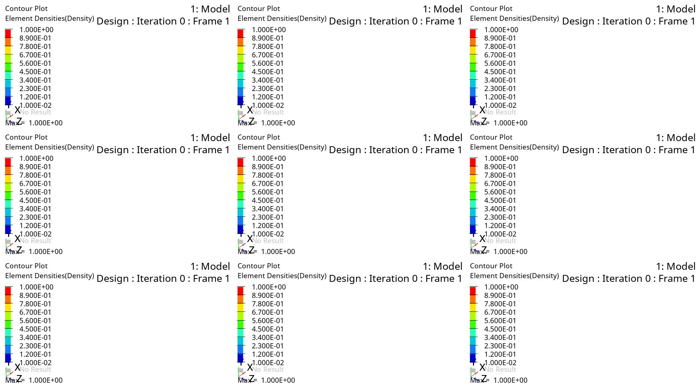

# Increasing the Structural Rigidity of the Manipulator

A research and development project focused on optimizing the structural rigidity of a robotic manipulator through topology optimization using the SIMP algorithm.


## Project Overview

This project addresses the challenge of improving the stiffness of a manipulator arm while maintaining mass constraints. The goal was to reduce tip deflection to ≤0.3mm under various loading conditions while limiting mass increase to no more than 15%.

### Key Objectives

- Reduce manipulator tip deflection to ≤0.3mm
- Maintain mass increase within 15% of original design
- Preserve existing joint angles (270° per joint)
- Minimize unique custom-manufactured parts

### Components Optimized

1. **Aluminum Bracket** - Main structural element
2. **Steel U-shaped Bracket** - Connection component
3. **Steel "Fin" Bracket** - Support structure

| Aluminum Bracket | Steel U-shaped Bracket | Steel "Fin" Bracket |
|:---:|:---:|:---:|
|  |  |  |

## Results Summary

| Parameter | Original Design | Optimized Design | Improvement |
|-----------|-----------------|------------------|-------------|
| Mass | 1.937 kg | 2.376 kg | +22.7% |
| Max Stress | 93 MPa | 25 MPa | -73% |
| Vertical Deflection (Fy) | 1.05 mm | 0.41 mm | -61% |
| Horizontal Deflection (Fx) | 1.03 mm | 0.31 mm | -70% |
| Longitudinal Deflection (Fz) | 0.62 mm | 0.21 mm | -66% |

**Note:** While significant improvements were achieved (57-76% reduction in deflections), the target of ≤0.3mm was not fully met. The final maximum deflection of 0.41mm exceeds the specification.

## Methodology

### Finite Element Modeling (FEM)


- **Shell Elements (QUAD4)**: Used for U-bracket and fin bracket (thin-walled structures)
- **Solid Elements (HEX8)**: Used for aluminum bracket and bearings
- **RBE2 Elements**: Used for bolt connections and servo motor modeling
- **Contact Modeling**: Slide-type contact between bearings and brackets

### Topology Optimization (SIMP Method)

The Solid Isotropic Material with Penalization (SIMP) method was employed to find optimal material distribution within design spaces. Key features:

- Minimization of weighted compliance (maximizing stiffness)
- Mass fraction constraints
- Manufacturing constraints (draw direction, minimum member size)
- Stress constraints (≤150 MPa)



## Project Structure

```
├── README.md                                              # This file
├── Increasing the structural rigidity of the manipulator ru.md  # Russian report
├── Increasing the structural rigidity of the manipulator en.md  # English report
└── media/                                                 # Images and animations
    ├── manipulator_*.jpg                                  # Manipulator views
    ├── FEM_*.jpg                                          # FEM model images
    ├── optimization_*.jpg/png/gif                         # Optimization results
    └── *.avi/*.mp4                                        # Video files
```

## Key Findings

1. **Topology optimization effectiveness confirmed**: The method successfully identified loaded and unloaded zones, enabling targeted geometry modifications.

2. **Design recommendations**:
   - Steel U-bracket: Expand base, increase wall thickness to 6mm
   - Aluminum bracket: Distribute mass along walls (I-beam profile tendency)
   - Steel fin bracket: Increase vertical wall thickness to 6mm

3. **Future improvements suggested**:
   - Consider replacing aluminum brackets with steel (E: 70 GPa → 200 GPa)
   - Explore alternative materials with higher elastic modulus
   - Relocate center of mass closer to the base
   - Allow greater mass increase if stricter deflection requirements must be met

## Optimization Results

| Steel Fin Bracket | Steel U-shaped Bracket | Aluminum Bracket |
|:---:|:---:|:---:|
|  |  |  |

### Optimized Structure Analysis

| FEM of Optimized Design | Results |
|:---:|:---:|
|  |  |

## Software Used

- **Altair OptiStruct**: FEM analysis and topology optimization
- **CAD Software**: 3D modeling and design space creation

## Author

**Arkhipov N.A.**  
Engineer  

## License

This is a proprietary research report. All rights reserved.
